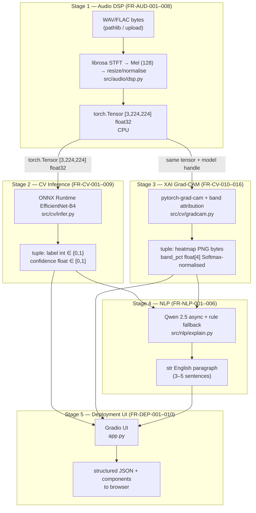

# DSDBA — Phase 0 Pipeline Architecture Diagram

**Document:** DSDBA-SRS-2026-002 v2.1  
**SDLC Phase:** 0 — Project Inception & Architecture Design  
**SRS Traceability:** FR-AUD-001–008, FR-CV-001–009, FR-CV-010–016, FR-NLP-001–006, FR-DEP-001–010  
**Label:** [Phase 0 | v1 | SRS-ref: multimodal pipeline]

---

## Feed-forward contract (Section 0.1 SRS)

The pipeline is **strictly sequential**: no feedback from NLP to CV, and no disk persistence of raw audio in production paths (NFR-Security).

---

## Mermaid — end-to-end data flow

Boundary labels use **exact conceptual types** crossing each interface.

---

## Arrow reference (boundary types)

| From → To | Payload | SRS |
|-----------|---------|-----|
| Upload → DSP | `bytes` / file-like, ≤ 20 MB | FR-DEP-002, FR-AUD-001 |
| DSP → CV | `Tensor [3,224,224] float32` | FR-AUD-008 → FR-CV-001 |
| CV → UI | `(label: int, confidence: float)` | FR-CV-004 |
| DSP + model → Grad-CAM | `Tensor` + `nn.Module` | FR-CV-010 |
| Grad-CAM → NLP | `band_pct: float[4]` + heatmap | FR-CV-014, FR-NLP-001 |
| NLP → UI | `str` explanation | FR-NLP-001 |
| CV → UI (ordering) | CV panel **before** NLP completes | FR-NLP-006 |

---

## Notes

- **ONNX** is mandatory for CPU inference on Hugging Face Spaces (**FR-DEP-010**); training remains PyTorch (**FR-CV-007**).
- **Q4** and **Q5** remain open until Sprint C; diagram assumes `config.yaml` locks until validated.
